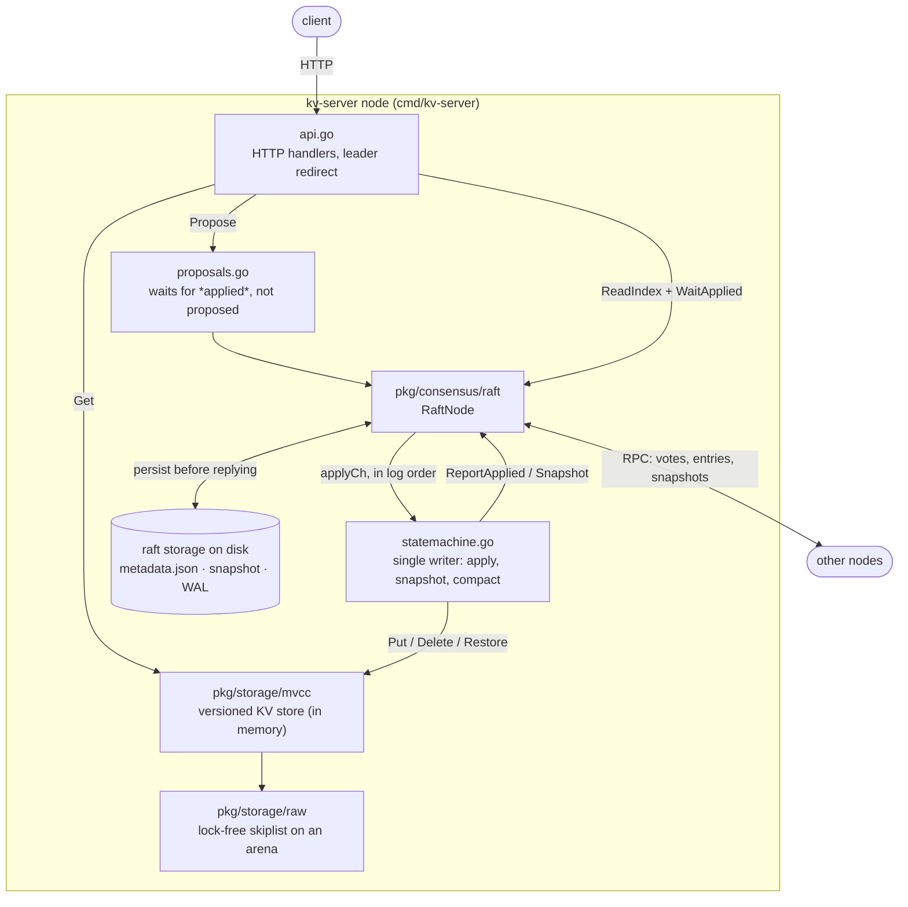
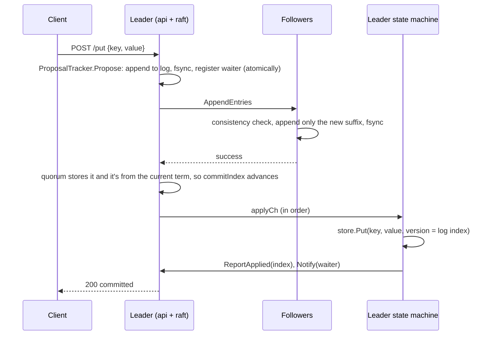

# Architecture

How the system works, why it is built this way, and how its correctness is verified. This is the document to read first; [concepts.md](concepts.md) covers the underlying theory, and the milestone docs record how each layer was designed.

## 1. The system in one picture

A client talks HTTP to any node. Writes go through Raft; the state machine applies committed entries to an in-memory MVCC store; Raft's own storage is the only thing on disk.



The layers, bottom up, each with one job:

| Layer | Package | Guarantee it gives the layer above |
|---|---|---|
| 0 | `pkg/storage/raw` | An ordered byte map; concurrent reads never block and never see torn values |
| 1 | `pkg/storage/codec` | Keys encode so byte order = (user key ascending, version descending) |
| 2 | `pkg/storage/mvcc` | Versioned reads at a timestamp; atomic whole-store replacement |
| Consensus | `pkg/consensus/raft` | Every node applies the same commands in the same order, and a write acknowledged to a client survives any minority of failures |
| Service | `cmd/kv-server` | Linearizable HTTP API |

## 2. Life of a write



Three details matter:

- **Acknowledged means applied, not proposed.** `Propose` returns as soon as the entry is on the leader's disk. If the leader crashed then, the entry could be lost or overwritten by the next leader. So the handler waits until the entry commits and applies at *that index with that term*. A different term at the index means a leadership change replaced our entry, and the client gets `409` and must retry (`proposals.go`).
- **No missed notifications.** The tracker holds its lock across `Propose` and waiter registration. Without that, a very fast commit could fire `Notify` before the waiter existed, and a successful write would time out.
- **The log index is the MVCC version.** Every replica applies index *i* with version *i*, so every replica ends up with identical versions and no clock is involved. (Milestone 4 introduces a Hybrid Logical Clock for cross-range transactions.)

## 3. Life of a read

`GET /get` is linearizable by default. It runs Raft's Read Index protocol (§6.4) in `read_index.go`:

1. **The leader must know its commit index is current.** A new leader doesn't yet know which earlier-term entries are committed. So on election it appends a **no-op** from its own term. ReadIndex waits for that no-op to commit.
2. **The leader must still be the leader.** A leader cut off in a minority partition doesn't know it has been replaced. ReadIndex sends a round of heartbeats and needs a quorum to answer in the current term.
3. **The local store must have caught up.** `WaitApplied(readIndex)` blocks until the *state machine* reports it has applied that far.

`?consistency=stale` skips all three and reads local state on any node. It's cheaper, but it may lag the leader.

## 4. Inside Raft (`pkg/consensus/raft`)

### File map

| File | Responsibility |
|---|---|
| `node.go` | The `RaftNode` struct, recovery on boot, the event loop (election timer, heartbeats), shared transitions (`becomeFollowerLocked`, `stepDownIfStaleLocked`), persistence, fail-stop, `Status` |
| `election.go` | Pre-Vote, real elections, `HandleRequestVote`, becoming leader (with the no-op) |
| `replication.go` | `Propose`, sending and handling `AppendEntries`, fast log backtracking, commit advancement |
| `snapshot.go` | `Snapshot` (compaction), sending and installing snapshots |
| `apply.go` | The ordered apply pipeline, `ReportApplied`, `WaitApplied` |
| `read_index.go` | Linearizable reads |
| `log.go` | The in-memory log, with a sentinel entry at the snapshot boundary |
| `storage*.go` | The `Storage` contract, an on-disk implementation, and an in-memory one for tests |
| `transport.go` | TCP RPC with one connection per peer |

### Concurrency model

One mutex (`rn.mu`) guards all protocol state. Every network call runs on its own goroutine with the lock *released*. When a reply comes back, the goroutine re-takes the lock and checks again that the role and term are what they were when it sent the request, because anything can change during a round trip (for example, `if rn.role != RoleLeader || args.Term != rn.currentTerm { return }`). Methods named `...Locked` require the lock. This keeps the protocol code sequential and easy to reason about, and the network never blocks it.

### The invariants, and where each is enforced

| Invariant | Mechanism | Code |
|---|---|---|
| **Election safety**: at most one leader per term | A node votes at most once per term, and that vote is durable *before* it's granted | `HandleRequestVote` → `persistLocked` |
| **Leader completeness**: an elected leader holds every committed entry | The Election Restriction: only vote for a candidate whose log is at least as up to date as yours | `candidateLogUpToDateLocked` |
| **Log matching** | The follower checks `(PrevLogIndex, PrevLogTerm)` and truncates only at a real conflict | `logMatchesLocked`, `RaftLog.TruncateAndAppend` |
| **Durable acknowledgements**: what a follower acks is on its disk | It persists exactly the suffix `TruncateAndAppend` wrote. Persisting the raw `args.Entries` would let a stale, reordered RPC truncate acknowledged entries (a bug this project had) | `HandleAppendEntries` |
| **Figure 8**: only commit by counting replicas for current-term entries | `advanceCommitIndexLocked` stops at the first earlier-term entry | `replication.go` |
| **State machine safety**: same commands, same order, everywhere | A single goroutine is the only sender on `applyCh` | `apply.go` |
| **"Applied" means applied** | `lastApplied` advances only on `ReportApplied`, which the state machine calls after the store reflects the entry. It gates reads and compaction | `apply.go`, `snapshot.go` |

### Liveness and efficiency features

- **Pre-Vote (§9.6).** A node first asks whether it *would* win, without changing any state. A partitioned node therefore can't inflate its term and depose a healthy leader when it reconnects. "Leader stickiness" also rejects pre-votes while a live leader is being heard.
- **Fast backtracking (§5.3).** A rejecting follower returns `ConflictTerm` and `ConflictIndex`, so the leader skips a whole term per round trip instead of one entry.
- **One snapshot in flight per peer.** Heartbeats would otherwise start a new multi-megabyte transfer every interval.
- **HardState is written only when term or vote changes.** Heartbeats cost no fsync. The persisted commit index is just a recovery hint, refreshed along with those writes.
- **Per-peer connections.** One dead peer's dial timeout never delays heartbeats to the others.

### Fail-stop

If storage fails, the node **halts**: it stops replying and closes `Done()`, and `Err()` reports the cause. A node that keeps running after its disk rejected a write would acknowledge votes and entries it doesn't actually hold. That silently breaks every invariant above. `kv-server` exits when `Done()` closes.

## 5. Durability and recovery

Raft storage (`storage_tidwall.go`) is the only durable state:

```text
<node>/raft/
├── metadata.json        term, vote, snapshot bounds, which WAL and snapshot are live
├── snap-<index>.dat     latest state machine snapshot
└── wal-<base>/          tidwall/wal segments; WAL index i holds Raft index i + base
```

- **`metadata.json` is the single commit point.** Every multi-file change writes its new files fully first, then atomically replaces the metadata (write a temp file, fsync it, rename it, fsync the directory). A crash leaves either the old state or the new one. Files that nothing references are deleted on the next open.
- **The base offset.** `tidwall/wal` requires an empty log to start at index 1. A follower that installs a snapshot at index *S* beyond its own log therefore starts a fresh WAL with base *S*.
- **A format version** in the metadata makes an incompatible data directory fail fast instead of being misread.

**On boot**, `NewRaftNode` delivers the stored snapshot to the state machine first, then every committed entry after it, in order. That's the same pipeline the node uses at runtime. The MVCC store starts empty, and this rebuilds it. `test_crash_recovery.sh` sends `SIGKILL` to all three nodes of a real cluster, restarts them, and checks that the data survived. Each node restores a snapshot and then replays the log.

## 6. Snapshots and memory

Two different things are both loosely called compaction:

| | What it bounds | Trigger | Code |
|---|---|---|---|
| **Log compaction** | Raft log length and restart replay time | Every `--snapshot-every` applied entries | `stateMachine.maybeSnapshot` → `RaftNode.Snapshot` |
| **Store compaction** | Memory used by dead MVCC versions | Store usage above 75% (with hysteresis), or a write that doesn't fit | `stateMachine.compact` → `mvcc.Store.Compact` |

The skiplist's arena is a bump allocator, which means no per-entry garbage for the Go GC. The cost is that it can't free individual entries. `Store.Compact` copies only the live data into a fresh engine and swaps it in atomically. Readers are never blocked, and writers pause only during the swap. `RestoreSnapshot` uses the same swap. That makes installing a snapshot a true replacement, whereas merging into the old store would bring back keys that were deleted before the snapshot.

Snapshots carry a magic header, an end marker and a CRC-32C, so a truncated or corrupt snapshot is rejected and the store stays untouched.

Both compactions run on the state machine goroutine, which is the store's only writer. So a snapshot always matches exactly the entries applied so far, and no write can race a compaction. If live data alone exceeds `--memtable-bytes`, applying fails and the node stops. Skipping a committed entry would make the replicas diverge.

## 7. How correctness is verified

| Level | What | Where |
|---|---|---|
| Unit | The log, storage contracts, codec ordering, skiplist concurrency, MVCC visibility, the snapshot format | `*_test.go` beside each file |
| Regression | Every bug found gets a test that failed before its fix | `raft_regression_test.go`, `raft_safety_test.go`, `snapshot_test.go` |
| Deterministic protocol | Figure 8, conflict hints, fail-stop, boot order, the no-op before reads | `raft_safety_test.go` |
| **Randomized fault injection** | A 5-node cluster with message drops, delays, duplicates and lost replies, partitions (including cutting off the leader), and crash-restarts (including the leader). It checks state machine safety, election safety, and durability of acknowledged writes | `chaos_test.go` |
| End to end | Real binaries over real TCP and HTTP, including a `SIGKILL` of every node | `test_cluster.sh`, `test_crash_recovery.sh` |

**Proof the chaos test has teeth.** A passing randomized test proves little unless it can fail. Known bugs were injected one at a time:

| Injected bug | Caught by |
|---|---|
| Persist the raw `args.Entries` (the original WAL-truncation bug) | Chaos test, every seed: acknowledged writes lost |
| Remove the Election Restriction | Chaos test: conflicting commands applied at the same index |
| Commit earlier-term entries by counting (Figure 8) | **Not** caught by the chaos test (the no-op makes the window too narrow to hit at random), so it's pinned by the deterministic `TestRaft_EarlierTermEntryNotCommittedByCounting` |

The first chaos harness caught none of the protocol bugs. Adding leader-targeted faults is what gave it teeth, which is why this check is worth running.

A soak of 10 seeds × 6 s (about 30,000 acknowledged writes, 116 crashes, 202 partitions) found no violations. Seeds reproduce the fault schedule: `RAFT_CHAOS_SEED=<n> go test -run TestRaft_Chaos ./pkg/consensus/raft/`.

## 8. Known limitations and next steps

Stated plainly, in rough priority order:

1. **Cluster membership is static.** There's no joint consensus or single-server change yet. This blocks range rebalancing in Milestone 3.
2. **The store is bounded by memory.** Durability comes from Raft snapshots plus the WAL, and live data must fit in `--memtable-bytes`. The next storage step is an LSM tree (flush the memtable to SSTables).
3. **Snapshots are sent in one RPC**, not streamed in chunks, and are held in memory.
4. **There's no linearizability checker.** The chaos test checks safety invariants, not full linearizability of client histories. The next step is recording client histories and running them through Porcupine.
5. **The fault schedule is seeded, but goroutine scheduling is not.** It's randomized testing, not deterministic simulation (FoundationDB and TigerBeetle style).
6. **Proposals aren't batched or pipelined.** Each proposal triggers its own broadcast, and the WAL fsyncs once per append.
7. **No metrics.** `/status` exposes state, but there's no Prometheus endpoint yet.
